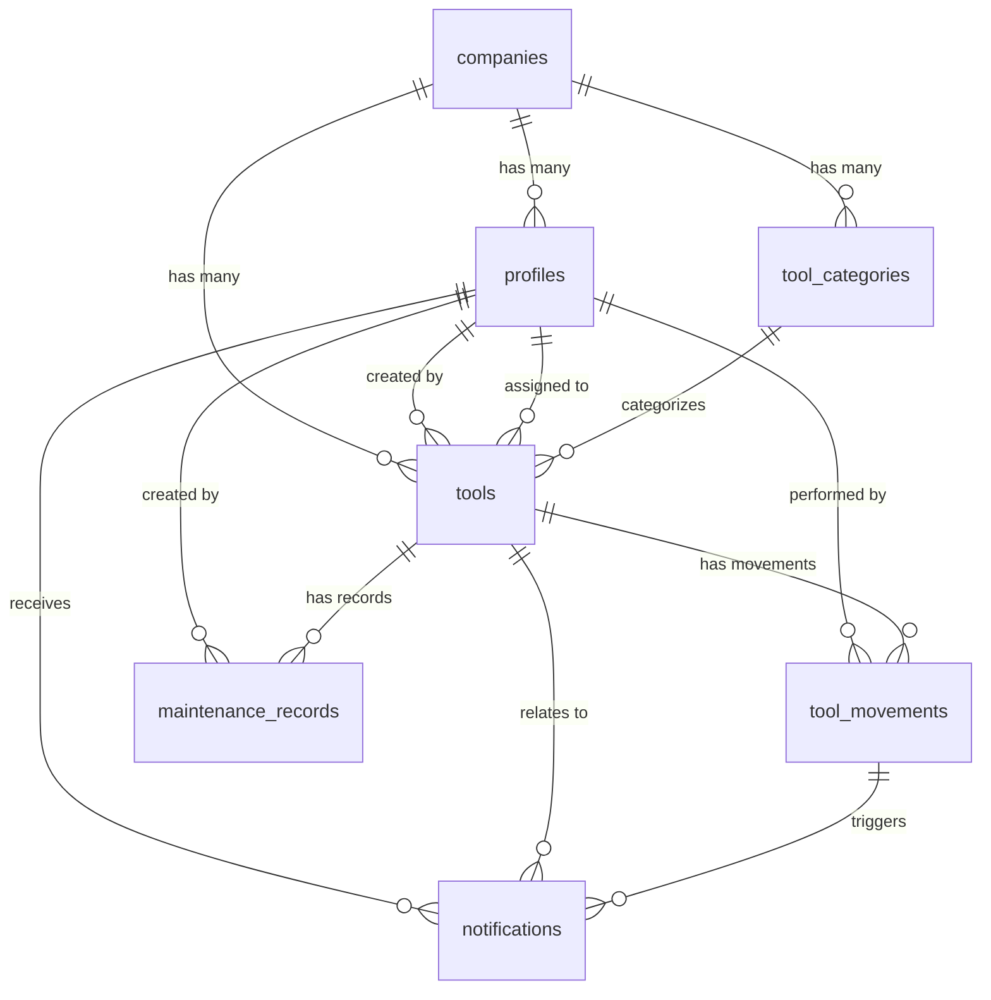

# 🏗️ Canteiro - Configuração do Supabase

## Instruções para Configuração Completa do Banco de Dados

### 📋 Pré-requisitos

1. Projeto criado no [Supabase](https://supabase.com)
2. Acesso ao SQL Editor do Supabase
3. Chaves de API configuradas no arquivo `.env`

### 🚀 Passos para Configuração

#### 1. **Configurar Variáveis de Ambiente**
Certifique-se de que seu arquivo `.env` possui as seguintes variáveis:

```env
EXPO_PUBLIC_SUPABASE_URL=sua_url_do_supabase
EXPO_PUBLIC_SUPABASE_ANON_KEY=sua_chave_anonima
```

#### 2. **Executar o Script SQL**
No Supabase Dashboard:
1. Vá para **SQL Editor**
2. Clique em **New query**
3. Copie e cole todo o conteúdo do arquivo `supabase/schema.sql`
4. Execute o script (Ctrl+Enter ou botão Run)

#### 3. **Verificar Tabelas Criadas**
Após executar o script, verifique se as seguintes tabelas foram criadas:
- ✅ `companies` - Empresas/Construtoras
- ✅ `profiles` - Perfis de usuário
- ✅ `tool_categories` - Categorias de ferramentas  
- ✅ `tools` - Ferramentas
- ✅ `tool_movements` - Movimentações de ferramentas
- ✅ `maintenance_records` - Registros de manutenção
- ✅ `notifications` - Notificações

#### 4. **Verificar RLS (Row Level Security)**
Certifique-se de que as políticas de segurança estão ativas:
- Vá para **Authentication > Policies**
- Verifique se existem políticas para todas as tabelas

#### 5. **Dados de Exemplo**
O script já inclui:
- ✅ 1 empresa de exemplo (Construtora ABC Ltda)
- ✅ 1 perfil para seu usuário (ID: 788c25fa-fc60-45d2-a118-bf4fb2e39ea5)
- ✅ 5 categorias de ferramentas
- ✅ 10 ferramentas de exemplo
- ✅ Registros de manutenção
- ✅ Notificações de exemplo

---

## 🔧 Funcionalidades Implementadas

### Dashboard
- ✅ Estatísticas em tempo real
- ✅ Atividades recentes
- ✅ Integração completa com dados reais

### Gestão de Ferramentas
- ✅ Listagem com filtros e busca
- ✅ Cadastro de novas ferramentas
- ✅ Detalhes completos
- ✅ Ações (emprestar, devolver, manutenção)

### Perfil do Usuário
- ✅ Informações pessoais
- ✅ Estatísticas de uso
- ✅ Configurações

### Segurança
- ✅ Row Level Security (RLS)
- ✅ Políticas baseadas em empresa
- ✅ Permissões por função do usuário

---

## 📱 Testando a Aplicação

### 1. **Login**
Use as credenciais que você criou no Supabase Auth

### 2. **Verificar Dados**
- Dashboard deve mostrar estatísticas reais
- Lista de ferramentas deve carregar 10 itens
- Perfil deve mostrar suas informações

### 3. **Testar Funcionalidades**
- ✅ Adicionar nova ferramenta
- ✅ Emprestar ferramenta
- ✅ Devolver ferramenta
- ✅ Enviar para manutenção
- ✅ Buscar e filtrar ferramentas

---

## 🔍 Estrutura do Banco de Dados



---

## 🎯 Próximos Passos Sugeridos

### Funcionalidades Avançadas
- [ ] QR Code Scanner para ferramentas
- [ ] Relatórios e Analytics
- [ ] Sistema de aprovações
- [ ] Integração com API de localização
- [ ] Push notifications
- [ ] Modo offline

### Melhorias de UX/UI
- [ ] Fotos das ferramentas
- [ ] Histórico detalhado de movimentações
- [ ] Calendário de manutenções
- [ ] Dashboard de métricas avançadas

---

## 🆘 Solução de Problemas

### Erro "Profile not found"
1. Verifique se o perfil foi criado corretamente na tabela `profiles`
2. Confirme se o ID do usuário corresponde ao do Supabase Auth

### Erro de RLS
1. Verifique se as políticas estão ativas
2. Confirme se o usuário pertence a uma empresa
3. Teste as consultas manualmente no SQL Editor

### Dados não carregam
1. Verifique a conexão com o Supabase
2. Confirme as variáveis de ambiente
3. Veja o console para erros específicos

---

## 📞 Suporte

Para dúvidas sobre a implementação:
1. Verifique os logs no console do React Native
2. Teste as queries diretamente no Supabase
3. Confirme se todas as tabelas e políticas foram criadas

---

**✨ Parabéns!** Seu sistema de gestão de ferramentas está pronto para uso! 🚀 